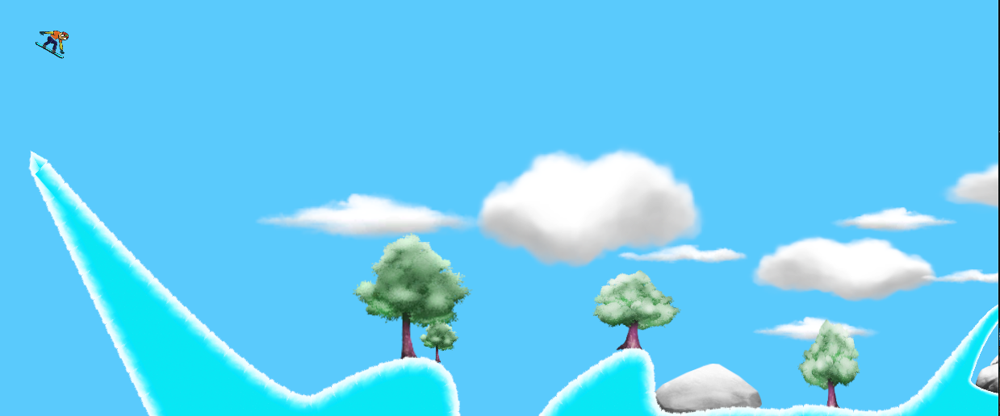

My Second Unity 2D game
# Snow Boarder

## About The Game
Description:
Embark on an exhilarating snowboarding adventure in "Snowboarder Rush"! Race down the snow-covered slopes, perform epic flips, and conquer challenging levels in this action-packed 2D snowboarding game.

## Key Features:

Thrilling Snowboarding Action: Feel the rush as you accelerate down the snowy hills, dodging obstacles and collecting power-ups along the way.

Epic Flips and Tricks: Show off your snowboarding skills by performing jaw-dropping backflips and frontflips with intuitive controls.

Beautiful Winter Landscapes: Explore stunning 2D winter landscapes filled with snow-capped hills, towering trees, fluffy clouds, and rocky terrain.

Multiple Levels: Conquer a series of progressively challenging levels, each with unique obstacles and surprises.

Race to the Finish: Race against the clock to reach the finish line and advance to the next level. Can you beat the best times and become the ultimate snowboarding champion?

Game Over Drama: Experience the heart-pounding moment of crashing onto the ground with realistic sound effects that add to the game's intensity.

Immersive Soundtrack: Enjoy a captivating soundtrack that enhances the overall gaming experience.

## Controls
-** Arrow Keys/Left or Right: ** Use to front or back flip
-** Spacebar: ** Use to accelerate on snow

## Initial Load

## Player In Action

## Player Crashes

## Finish Line

## Authors
- **Kevin Yang** - *Initial work* - [kevinYang0612](https://github.com/kevinYang0612)
